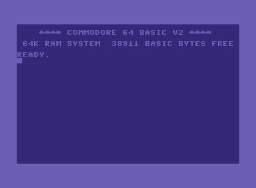
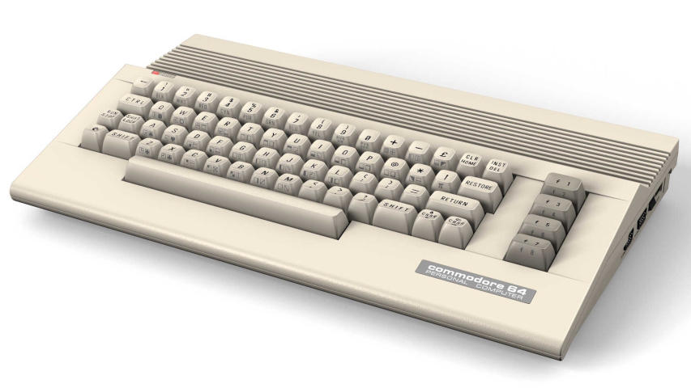
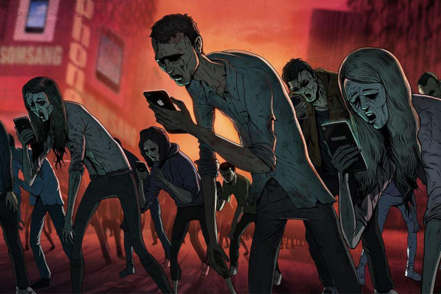

+++
title = "Hogyan imádkozol a számítógéphez?"
date = 2023-12-17
+++

Játszol rajta?
Simogatod a képernyőjét?
Netán nyelveken szólsz hozzá…?

```python
def sóder(m3):
    """
    >>> sóder(1.5)
    '1.5 m³ sóder ≈ 2.33 t ... 2.47 t ... 2.62 t'
    """
    return (
        f"{m3} m³ sóder"
        f" ≈ {1.55*m3:.2f} t"
        f" ... {1.65*m3:.2f} t"
        f" ... {1.75*m3:.2f} t"
    )
```

Valahányszor egy számítógéphez fordulunk válaszért, megoldásért
– akár egy számításra, akár az unalomra –,
mindannyiszor a géphez imádkozunk.

A Teremtőnk helyett egy gépre vagyunk kíváncsiak.
Arra figyelünk.
Azt imádjuk.

Ezt csinálom én is.
Még most is.
A legutóbbi örömhír után erősen megkísértett a programozgatás.
Azzal az ürüggyel,
hogy amit írnék,
segítené a munkámat.
Nagyon foglalkoztat a dolog.
Leköti a figyelmemet.
Beszippantja, mint egy örvény.
Persze a Teremtőm szavát így egyáltalán nem hallom.
Nem érnek sem megértések,
sem szembesülések,
sem lelki örömök.

Tökéletes csapda a lélek számára.
Belépő a pokolba.

Tegnap nekiálltam írni erről.
Kínomban.
Nem ment.
Letöröltem.
Ma viszont megláttam [Kornélia legfrissebb bejegyzését][1],
amelyben a digitalizációt is említi.
Hogy az is a lélek elleni harc része.
És micsoda véletlen (nem az!),
éppen tegnap láttam egy cikkben,
hogy a szakképzésért felelős helyettes államtitkár szerint
a digitalizációnak ma már minden tantárgyba,
így a szakmai tárgyak oktatásába is be kell épülnie.

[1]: https://www.youtube.com/post/Ugkx3pRsxigoHzoAOVDIwm6IhPwGpyj9k-5p

És persze jön a digitális állampolgárság is.
(Digitális állampolgár.)

Meg aztán lépten-nyomon alkalmazásokat kínálnak neked.
Töltsed le, ingyen van!
(Csak a lelkedbe kerül.)
Kedvezményesen vásárolhatsz, ha használod!
(Drágábban adják neked, ha nem használod.
Ma.
Holnap?
Holnap úgy már semmit se kapsz.)

És lassan már mindenhol QR-kódokat kell beolvastatnod,
mert nem süllyednek le odáig,
hogy emberi nyelven írjanak neked valamit…
Vedd csak elő a hardvert! A vasat.
(Holnap már te leszel a vas.
Élő szövet a fémvázon.)

Szóval a csapból is digitalizáció folyik.
Magyarországon is.
Az állam teljes támogatásával.
Az ember digitalizációja.
Meg sem állunk,
amíg 1-esek és 0-k sorozatává
nem csökevényesedünk.

Magyar állam, te az ördög atyától való vagy,
és a te atyád kívánságait akarod teljesíteni.
Gyermekvédelmet hazudsz,
közben az oktatási rendszered teljes erejével
megrontod a gyerekeket,
öldösöd a lelküket,
és kiszolgáltatod őket a te atyádnak,
akivel a tűz és kénkő tavába mennek égni örökre.
Békét és biztonságot hazudsz,
közben gyilkolod az embereket,
például oltásokkal,
és ellelketlenedett sarlatánokkal,
akikkel egyre inkább feltöltöd
az egészségügynek hazudott mészárszékedet.

Vissza a lélek elleni harcra.
A digitalizáció bizony az.
A számítógép pedig fegyver.
A lélek ellen.
Tapasztalom.
Magamon.
Ezzel kezdődött tizenéves koromban:

<figure>

</figure>

Nyomot hagyott bennem ez a látvány.
Szinte belém égett.

<figure>

</figure>

Megfogott a gép alakja is.
És a billentyűk nyújtotta érzés.
Bár a fenti változat csak a nagybátyámnak volt.
Nekünk az öcsémmel a „kenyértartó” jutott.

Eleinte a játékok is érdekeltek,
de az,
hogy ezeket a gépeket
rögtön neki lehetett állni programozni,
az hatásosabbnak bizonyult.
A lehetőség,
hogy megmondhatom a gépnek,
mit csináljon.
És bár a gép a maiakhoz képest igencsak szerény volt,
a felhasználási lehetőségek száma mégis kimeríthetetlennek tűnt.

Nem tudtam, mibe megyek bele.
A szüleim sem tudták.
Csak megadták, amire vágytam.
Vágytunk, az öcsémmel.
Aztán jött a PC.
Na, az volt aztán az igazi csapda.
Ilyen alaplap, olyan alaplap;
ilyen CPU, olyan CPU;
ilyen bővítőkártya, olyan bővítőkártya;
ilyen operációs rendszer, olyan operációs rendszer;
ilyen játék; olyan játék;
ilyen programozási nyelv, olyan programozási nyelv.
Mindig volt mit bütykölni.
Mindig jött valami újabb dolog,
amivel el lehetett vacakolni.
(A lelkemet.)

És azok még minden téren kezdetlegesebb gépek voltak.
Kevesebb felhasználási lehetőséggel.
Főleg a 8 bitesek, mint a C64.
Mégis képesek voltak megragadni a figyelmemet,
mint sok más fiatalét.

A mai gépek sokkal hatásosabbak.
Talán már nincs is senki,
akit ne tudnának megragadni valamivel.
Mindenkinek kínálnak valamit.
Valami nélkülözhetetlennek tűnőt.
Ó, milyen kényelmes!
Ó, mennyi időt megtakarítok vele (az ördögnek)!

Ezekhez a maiakhoz már nem is kell érteni:
elég, ha simogatni meg nyalogatni tudod a képernyőjüket.

<figure>

</figure>

És itt van egy másik csapda.
Vannak, akik visszasírják a régi szép(nek vélt) időket.
Amikor még viszonylag egyszerűek voltak a gépek.
Nem kémkedtek utánad.
Lassabbak voltak,
de gyorsabban elindultak.
Beépített programozási nyelvet kínáltak.
Jól dokumentáltak voltak,
a programozásuktól egészen a kapcsolási rajzukig.
Satöbbi.

És akkor ezek az emberek nekiállnak régi gépeket gyűjteni meg felújítani.
Esetleg mai hardverelemekből régies gépeket építeni.
Ezzel megmaradnak a gépnél.
Nem fordulnak a Teremtőhöz!
Elpazarolják a lelküket!

Bennem is van nosztalgia.
Utálom, hogy hová „fejlődtek”, hová vezettek a számítógépek.
Utálom a mesterséges értelmet is.
Viszont már megtörtént a baj.
Hiszen már régen megfogott a gép.
És nem tudok szabadulni tőle.
Ez vált tagadhatatlanná a napokban.

Én magam nem tudok mást tenni,
csak bevallani mindazt,
amit itt leírtam.
Gépet imádok, azt bálványozom,
és nem tudok megszabadulni
az emberi kéz és elme eme csinálmányától.

Csak Jézus Krisztusban bízhatok.
Hogy Ő megszabadít.

Úgy a géptől,
mint attól a képmutatástól,
hogy a mai számítógépeket utálom és megvetem,
de a régiekre nosztalgiával tekintek.
Hiszen nincs lényegi különbség!
Még egy közönséges számológépnek is ugyanaz a lényege,
mint egy olyan számítógépnek, amelyiken mesterséges értelem fut.
Mindegyik gép!
Halott anyag.

És amíg gépekre figyelek,
addig a Teremtőtől elfordulok.
Az élettől és az igazságtól.
Sőt, Őt megtagadom azzal,
hogy gépekhez fordulok válaszokért.
Inkább vagyok kíváncsi egy gép szavára,
mint a Teremtőmére!
Őrület!

> Ne szeressétek a világot,
> se azokat, a mik a világban vannak.
> Ha valaki a világot szereti,
> nincs meg abban az Atya szeretete.
> Mert mindaz, a mi a világban van,
> a test kívánsága,
> és a szemek kívánsága,
> és az élet kérkedése
> nem az Atyától van,
> hanem a világból.
> És a világ elmúlik,
> és annak kívánsága is;
> de a ki az Isten akaratát cselekszi,
> megmarad örökké.
>
> <i>1János 2,15–17</i>
